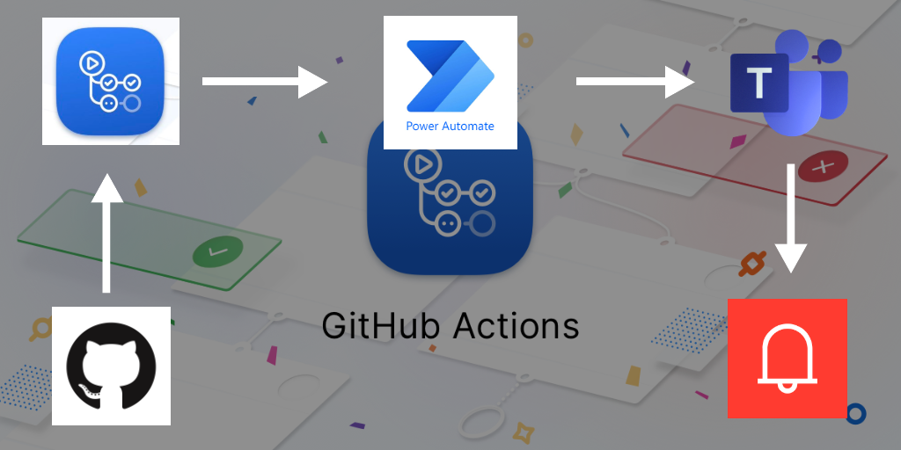
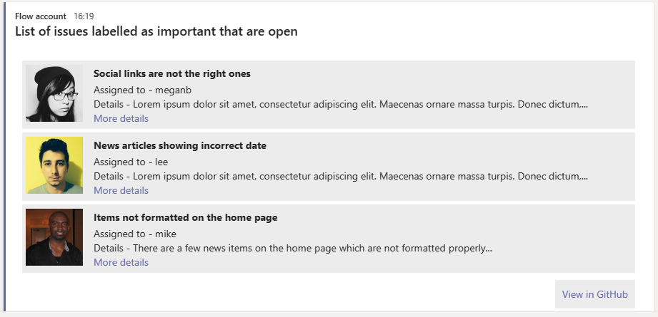

# GitHub Action to get issues and then call an HTTP endpoint

This action gets the issues in a repository marked with specified label. After that it posts those issues to a HTTP endpoint (Flow or Logic App) which can then post those issues in a nicely formatted way to a Teams channel.

### Overall structure of the action


### End result i.e. the message on Teams


## Pre-requisites
The action requires a HTTP triggered Flow to be created. So please make sure to create Flow [like this one](https://github.com/anoopt/get-issues-http-post/blob/main/assets/Post_GitHub_Issues_to_Teams_Channel.zip) before using this action.

## Inputs
The action requires the following inputs:
- `githubToken` : The GitHub Secret Token.
- `filterLabel` : The label with which the required issues are tagged. e.g. bug
- `filterState` : The state of the required issues. e.g. open
- `httpEndpoint` : The URL of the HTTP triggered Flow created earlier. (Found in the first step of the Flow)

## Usage
Below is a sample workflow code
```yaml

name: Weekly Issues Report

on:
  schedule:
    # Runs at 9AM UTC every Monday 
    - cron:  '0 9 * * 1'
jobs:
  GetIssues:
    runs-on: ubuntu-latest
    steps:
      - name: Get issues and call flow using action 
        uses: anoopt/get-issues-and-call-flow@master
        with:
          githubToken: ${{ secrets.GITHUB_TOKEN }}
          filterLabel: bug
          filterState: open
          httpEndpoint: https://prod-16.uksouth.logic.azure.com:443/workflows/......
```